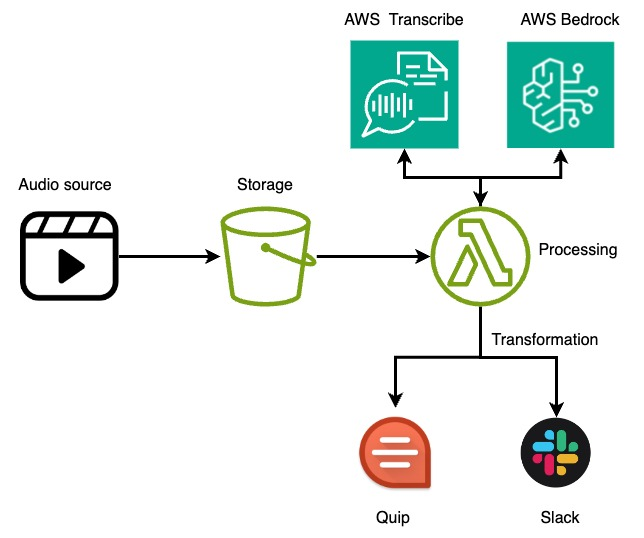

# AWS Transcribe + Bedrock

This project uses AWS Transcribe to convert speech to text, and then feed it to AWS Bedrock for key points summarization.  

* Your video is uploaded to bucket `recording-storage-<ACCOUNT-NUMBER>` with prefix `video/`

API example
`aws s3api put-object --bucket recording-storage-<ACCOUNT-NUMBER> \
    --key video/<VIDEO_NAME>.mp4 --body <LOCAL_DEST>/<VIDEO_NAME>.mp4`

* Your Transcript is saved in bucket `recording-storage-<ACCOUNT-NUMBER>` with prefix `transcripts/`

## Useful commands

* `npm install -g aws-cdk`   install cdk 
* `cdk bootstrap aws://ACCOUNT-NUMBER/REGION`   bootstrap your environment
* `npm run build`    build the app
* `cdk synth`  synthesize an AWS CloudFormation template
* `cdk deploy`    deploy CDK stack to AWS CloudFormation

## Useful links:
https://docs.aws.amazon.com/cdk/api/v2/
